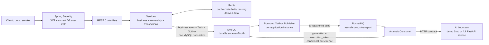

# CourseInsight Cloud

CourseInsight Cloud 是一个可本地运行的 Java 后端项目：Spring Boot API 处理课程与评价，MySQL 保存
业务与任务状态，Redis 提供缓存、限流和排行榜，Transactional Outbox + RocketMQ 驱动异步分析，
AI 通过独立 HTTP 边界接入。

本仓库的 recruiting demo 只复用现有业务链路，不需要模型权重、LLM Key 或付费 API。

## Quick Start

### 前置条件

- JDK 17（不是仅有 JRE）；
- Docker Desktop / Docker Engine，包含 Docker Compose v2；
- Git。Maven 无需单独安装，仓库已包含 Maven Wrapper。

### Windows PowerShell

```powershell
git clone https://github.com/mofengyan595/courseinsight-cloud.git
Set-Location courseinsight-cloud

# 构建 deterministic AI Stub，启动并等待 MySQL / Redis / RocketMQ / Stub
.\scripts\demo.ps1 start

# 保持此终端运行 Spring Boot
Set-Location courseinsight-server
.\mvnw.cmd spring-boot:run '-Dspring-boot.run.profiles=demo'
```

应用出现 `Started CourseinsightServerApplication` 后，在仓库根目录打开第二个 PowerShell：

```powershell
.\scripts\demo.ps1 ready
.\scripts\demo.ps1 smoke
```

### macOS / Linux Bash

```bash
git clone https://github.com/mofengyan595/courseinsight-cloud.git
cd courseinsight-cloud

bash scripts/demo.sh start

cd courseinsight-server
./mvnw spring-boot:run -Dspring-boot.run.profiles=demo
```

在仓库根目录的第二个终端运行：

```bash
bash scripts/demo.sh ready
bash scripts/demo.sh smoke
```

首次运行需要拉取 Docker/Maven 依赖，耗时取决于网络；依赖缓存后，业务演示本身通常在一分钟内完成。
`start` 会优先复用本地 deterministic AI Stub 镜像，因此后续启动不需要再次访问 Docker Hub。
只有 Stub 源码发生变化并需要强制重建时才运行：

```powershell
.\scripts\demo.ps1 start -Rebuild
```

```bash
bash scripts/demo.sh start --rebuild
```

如果首次构建出现 `failed to fetch oauth token`，这是 Docker 到 `auth.docker.io` / `registry-1.docker.io`
的网络或代理问题；确认 Docker Desktop 代理/DNS 后重试。它不是 Java、MySQL 或项目凭据错误。

### 停止

先在 Spring Boot 终端按 `Ctrl+C`，再从仓库根目录停止依赖。默认保留 demo 数据卷，便于下次复用：

```powershell
.\scripts\demo.ps1 stop
```

```bash
bash scripts/demo.sh stop
```

只有明确要删除 **demo 专用数据** 时才运行：

```powershell
.\scripts\demo.ps1 clean -ConfirmDeleteData
```

```bash
bash scripts/demo.sh clean --confirm-delete-data
```

## 10-Minute Demo

`smoke` 使用 [`docs/examples/analysis-batch-sample.csv`](docs/examples/analysis-batch-sample.csv) 自动验证：

```text
Actuator health
→ JWT 登录
→ 创建并读取一门课程
→ 上传 3 行 CSV
→ 轮询 PROCESSING / COMPLETED
→ 读取 3 条确定性分析结果
```

脚本逐步输出 `[PASS]` / `[FAIL]`，并显示异步任务的 waiting、processing、success、failed 变化。
它只回答“reviewer 能否跑通演示”，不替代完整测试套件。

Demo 账号仅由 `demo` profile 在隔离数据库中创建：

| 用户名 | 密码 | 角色 |
| --- | --- | --- |
| `demo_admin` | `demo-admin-password` | `ADMIN` |

这些是提交在 [`demo.env`](demo.env) 中的公开本地演示凭据和演示 JWT secret，**绝不能用于其他环境**。
普通 `local` / production-like 配置不会默认启用该账号。

## Startup Map

### Minimal Demo 与可选组件

| 范围 | 组件 | 是否必需 | 用途 |
| --- | --- | :---: | --- |
| Minimal Demo | Spring Boot / JDK 17 | 是 | API、安全、业务、Outbox publisher、MQ consumer |
| Minimal Demo | MySQL 8.4 | 是 | durable source of truth；Flyway 自动执行 V1–V15 |
| Minimal Demo | Redis 7.2 | 是 | cache-aside、限流、排行榜派生数据 |
| Minimal Demo | RocketMQ 5.3.2 | 是 | 异步传输与 redelivery |
| Minimal Demo | 100 ms deterministic AI Stub | 是 | 复用真实 HTTP contract，不加载 BERT、不调用 LLM |
| Full Local | FastAPI + BERT/TF-IDF/rules | 否 | 验证真实 AI service 边界；构建更慢，可选 LLM |
| Observability | Prometheus + Grafana | 否 | Actuator/Micrometer 指标与 dashboard |
| Benchmark | k6 + Stub + 指标采集脚本 | 否 | 受控性能实验，不属于 Quick Start |

### 端口与就绪判断

| 组件 | 本机端口 | 如何判断 ready |
| --- | ---: | --- |
| Spring Boot | `8080` | `GET /actuator/health`；demo profile 显示 MySQL/Redis 组件状态 |
| MySQL | `3307` | Compose healthcheck；同时影响 Actuator health |
| Redis | `6380` | Compose `PING` healthcheck；同时影响 Actuator health |
| RocketMQ NameServer | `9876` | Compose TCP healthcheck |
| RocketMQ Broker | `10911`, `10909` | Compose TCP healthcheck |
| AI Stub | `8002` | `GET /health`，返回 `deterministic: true` |
| Prometheus / Grafana | `9090` / `3000` | 可选 profile 自带 healthcheck |

`/api/health` 只是轻量 liveness；`/actuator/health` 才包含 Spring 管理的依赖状态。当前没有
RocketMQ 或 AI 的 Actuator `HealthIndicator`，因此 `scripts/demo.* ready` 还会检查对应容器健康，
不能只看一个 HTTP 200 就判断整条异步链路可用。Actuator 仍只暴露 `health,prometheus`，
`show-details` 保持关闭。

### Application profiles

| Profile | 配置来源 | Compose 行为 | AI / seed 行为 |
| --- | --- | --- | --- |
| `demo` | 提交的 `demo.env` | 脚本显式管理 `compose.demo.yaml`；Boot 不自动改容器 | 8002 Stub；仅此 profile 启用 demo admin |
| `local` | 本地未提交的 `.env` | Spring Boot Compose `start-only`，Java 退出后容器保留 | 完整 AI service；bootstrap admin 默认关闭 |
| `test` | `src/test/resources` | 不启动项目 Compose | 外部 HTTP/MQ 通常使用 mock，MySQL/Redis 语义使用 Testcontainers |
| default | 环境变量 | 不自动启动 Compose | 需要调用方提供真实依赖配置 |

Java 应用创建 HTTP client 时不会主动调用 AI；分析任务消费时才访问 AI。`local` profile 仍会因为
Spring Boot Compose 等待完整 AI 容器 healthcheck 而受其启动状态影响；`demo` profile 用 Stub 避免该问题。
除 demo admin 外，Flyway 不插入业务样例数据；smoke 每次通过真实 API 创建带唯一 code 的课程和 batch。

## Architecture



这是一个 Spring Boot 后端加独立 AI HTTP 边界的本地架构，不是微服务集群。MySQL 保留可恢复状态；
Redis 数据可重建；RocketMQ 负责传输而不是业务真相；Outbox 与 fencing 处理的是特定失败窗口，
并不把系统变成 exactly-once。

## Core Technical Highlights

- Spring Security + HS256 JWT；每次鉴权重新读取当前用户 role/status，服务层继续校验课程归属；
- Task 与 Outbox event 在一个 MySQL 事务中写入，隔离 DB/MQ dual-write 窗口；
- RocketMQ 按 at-least-once 处理，consumer 使用 `current_event_id` generation 与 `execution_token` fencing；
- Outbox claim 使用 `publish_token`，迟到的旧 publisher 不能标记新 attempt 的 `SENT` / `FAILED`；
- execution lease 与 stale recovery 使用 MySQL `CURRENT_TIMESTAMP(3)`，避免 JVM 时钟参与所有权判断；
- publisher 使用固定线程池和提交窗口限制单实例并发，scheduler cycle 也防止重叠；
- Redis cache-aside 在事务提交后失效，读取/写入失败时回退 MySQL；排行榜通过 Lua 最后发布 READY marker；
- MySQL 8.4 / Redis 7.2 的关键语义由 Testcontainers 覆盖，普通 AI/MQ/HTTP 测试使用 mock/fake；
- k6 报告保存固定 workload、Git commit、Prometheus/RocketMQ/backlog/outcome 证据，而不是只保存吞吐数字。

## Reliability Boundaries

- **Outbox 为什么存在：** 避免“DB 已提交但消息未发”或“消息已发但业务事务未提交”的直接 dual-write。
- **仍是 at-least-once：** Broker 接受后、Outbox 标记 `SENT` 前崩溃会触发重发；MQ 本身也可能 redeliver，
  所以重复处理仍然可能发生。
- **`execution_token`：** 标识一次 worker claim。结果/失败写入必须同时匹配任务、当前 generation、
  `PROCESSING` 和 token，旧 worker 无法覆盖新 owner。
- **`publish_token`：** 标识一次 Outbox claim。迟到的 send success/failure 只能修改自己仍拥有的 attempt。
- **lease 到期：** 表示该执行可以被恢复器视为失联，并生成新的 Outbox event/generation；它不证明旧 worker
  已停止。当前没有 execution lease heartbeat，超长 AI 调用可能造成重复外部调用。
- **fencing 的边界：** 条件写能阻止 stale state overwrite，但不能撤销已经发生的 AI HTTP 调用或消息发送。
- **缓存一致性：** after-commit invalidation 是 best-effort，没有 durable invalidation retry。失败时可能暂时读到旧值，
  最终依赖后续失效/重填和 5–30 分钟 TTL 收敛；Redis 故障时读路径回退 MySQL。
- **bounded publisher：** 并发上限只约束一个应用实例；多实例部署时不是 cluster-wide 全局上限。

## Project Structure

```text
courseinsight-cloud/
├─ courseinsight-server/       Spring Boot / MySQL / Redis / RocketMQ backend
├─ courseinsight-ai-service/   完整 FastAPI BERT / TF-IDF / rules service
├─ scripts/                    demo 与 Java 分层测试入口
├─ docs/examples/              小型 deterministic CSV
├─ performance/ai-stub/        demo/benchmark 共用的 HTTP Stub
├─ performance/k6/             受控 workload、数据准备、聚合与清理脚本
├─ performance/results/        报告和机器可读原始结果索引
├─ deploy/observability/       Prometheus / Grafana provisioning
├─ compose.demo.yaml           Minimal Demo 依赖
└─ compose.yaml                Full Local + optional observability
```

## Testing

从仓库根目录运行：

```powershell
# 无 Docker：unit、MVC/security slice、mock HTTP/MQ
.\scripts\test.ps1 -Suite fast

# Docker：真实 MySQL/Redis Testcontainers 语义
.\scripts\test.ps1 -Suite integration

# 全部 Java 测试
.\scripts\test.ps1 -Suite all
```

编译但不运行测试：

```powershell
Set-Location courseinsight-server
.\mvnw.cmd -DskipTests package
```

Demo smoke 入口是 `scripts/demo.ps1 smoke` / `scripts/demo.sh smoke`。完整测试不读取根目录 `.env`，
也不会启动完整 Compose；详细隔离规则见 [`docs/development.md`](docs/development.md)。

## Performance / Benchmark Reproduction

仓库保留现有报告，不在 Quick Start 中自动重跑昂贵实验。结果只对报告记录的 HEAD、单机环境、
workload 和重复次数成立。

### Redis strict A/B

- 条件：100 RPS × 30 秒，`constant-arrival-rate`，相同 ID 顺序，miss/hit 交替且各 3 次；
- Course detail：p95 `14.31 → 10.69 ms`（-25.34%），p99 `17.37 → 12.30 ms`（-29.16%），
  MySQL `Com_select/run` `6039 → 3039`（-49.68%）；
- 证明：该固定本机 workload 下，现有 warm-cache 路径减少数据库读取和 tail latency；
- 不证明：生产容量或零数据库访问。JWT current-user 刷新仍查询 `app_user`。

复现入口：

```powershell
$env:PERF_USERNAME = 'perf_http_p3'
$env:PERF_PASSWORD = '<local-random-password>'
.\performance\k6\scripts\prepare-http-data.ps1 -DatasetPrefix 'PERF_HTTP_P3' -CourseCount 60010
.\performance\k6\scripts\run-http-experiment.ps1 -Mode Ab -ExperimentId P3_HTTP
.\performance\k6\scripts\aggregate-http-benchmark.ps1 -ExperimentId P3_HTTP
```

完整前提、预热、SLO 与原始证据见
[`performance/k6/HTTP_BENCHMARK.md`](performance/k6/HTTP_BENCHMARK.md) 和
[`Phase 3 报告`](performance/results/2026-08-09-phase-3-http-cache-P3_HTTP.md)。

### Bounded Outbox Publisher

- 条件：1000 tasks（5 × 200-row API batch）、100 ms deterministic Stub、consumer 8、Outbox batch 100、
  fixed delay 1000 ms，serial baseline 与 bounded concurrency 4 各 3 次；
- 结果：mean completion `27.559 → 20.326 s`（-26.25%），throughput `36.595 → 49.468 tasks/s`（+35.18%）；
- 证明：该固定本机 Stub workload 下，有界并发提升 publisher 供给能力且 6000/6000 candidate tasks 成功；
- 不证明：真实 BERT/LLM 性能、生产容量或多实例全局并发。应用默认仍保守使用 publisher concurrency 2。

精确命令、配置覆盖和聚合入口见 [`performance/k6/PHASE7.md`](performance/k6/PHASE7.md)，
结果与限制见 [`Phase 7 报告`](performance/results/2026-08-10-phase-7-outbox-publisher-P7_OUTBOX.md)。

## Observability

Prometheus/Grafana 不属于 Minimal Demo。应用运行时，可从仓库根目录按所用环境选择 env file：

```powershell
# 与 demo profile 配合
docker compose --env-file demo.env -f compose.yaml --profile observability up -d prometheus grafana
```

- Actuator health：<http://localhost:8080/actuator/health>
- Prometheus metrics：<http://localhost:8080/actuator/prometheus>
- Prometheus targets：<http://localhost:9090/targets>
- Grafana dashboard：<http://localhost:3000/d/courseinsight-overview/courseinsight-overview>

业务 `/api/**` 的 JWT 规则没有因为 Actuator 而放宽；自定义指标只使用固定枚举 outcome，避免用户、任务、
UUID 等高基数标签。完整说明见 [`docs/development.md`](docs/development.md#本地监控)。

## Development Setup

完整 AI 环境使用未提交的 `.env` 和 `local` profile：

```powershell
Copy-Item .env.example .env
Set-Location courseinsight-server
.\mvnw.cmd spring-boot:run '-Dspring-boot.run.profiles=local'
```

填写 `.env` 中的本地数据库/JWT 配置；LLM 仍是可选能力。`local` 使用 Spring Boot Compose
`start-only`，Java 退出后依赖继续运行；从根目录执行 `docker compose stop` 安全停止且保留数据。
更多 IDE、测试与监控说明见 [`docs/development.md`](docs/development.md)。

## Known Limitations

- recruiting demo 的 admin 凭据和 JWT secret 是公开、固定且仅限本机演示；
- demo AI 是固定 100 ms contract Stub，不能展示真实模型质量或推理性能；
- Actuator health 不包含 RocketMQ/AI，必须结合 `scripts/demo.* ready`；
- execution lease 当前没有 heartbeat；fencing 防止旧结果覆盖，但不能避免所有重复外部调用；
- Outbox publisher 上限是单应用实例级别；本仓库没有验证多实例 cluster-wide 容量；
- Quick Start 在宿主机运行 Java、Docker 运行依赖，未把项目包装成微服务或 Kubernetes 系统。
