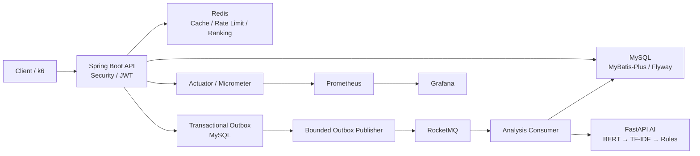
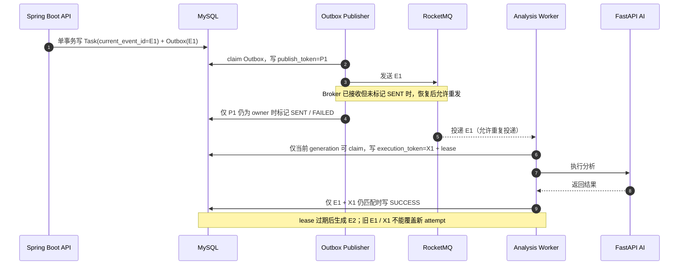

# CourseInsight Cloud

CourseInsight Cloud 是一个面向课程评价与教学分析的后端工程项目。它以 Spring Boot API
承载用户、课程、评价和批量分析业务，通过 Redis 提供缓存、限流与排行榜，通过
Transactional Outbox + RocketMQ 驱动异步分析，并由 FastAPI AI 服务完成
BERT / TF-IDF / 规则降级分析。

项目重点不是堆叠组件，而是把权限、事务边界、消息重复、过期执行、可观测性和可重复性能实验
落实到可验证的实现中。

## 核心功能

- Spring Security + JWT 无状态认证，支持 STUDENT / TEACHER / ADMIN 权限与对象归属校验；
- MyBatis-Plus + MySQL 持久化，Flyway 管理 15 个增量迁移；
- Redis cache-aside 课程详情/统计缓存、Lua 固定窗口限流、ZSet 热度排行与原子 READY 发布；
- RocketMQ 异步分析、失败重试与死信恢复，Transactional Outbox 保证任务与待发布事件同事务落库；
- `current_event_id`、`execution_token`、lease 与 Outbox `publish_token` 共同隔离过期 attempt；
- CSV 批量导入、进度查询、结果分页、失败重试和 UTF-8 CSV 导出；
- FastAPI AI 服务优先使用 BERT，不可用时降级到 TF-IDF / 规则；教学建议支持可选 LLM 与本地降级。

## Architecture



这是一个 Spring Boot 应用加独立 AI HTTP 服务的本地可运行架构，不代表已经验证过的分布式集群容量。

### 运行与测试边界

| 层次 | 使用内容 | 边界 |
| --- | --- | --- |
| 真实应用逻辑 | Spring Boot、MySQL、Redis、RocketMQ、FastAPI AI；Outbox 默认 batch 20、发布并发 2、消费并发 1 | 常规本地运行链路，AI 可实际加载 BERT，并非性能 Stub |
| 性能测试专用配置 | k6、Prometheus / RocketMQ 原生指标，以及按实验覆盖的 batch、publisher、consumer 参数 | 只用于受控实验；Phase 7 的 batch 100、publisher 4、consumer 8 不是默认参数 |
| AI Stub 测试环境 | `performance/ai-stub` 提供相同 HTTP contract 和可配置固定延迟 | 不加载 BERT、不调用 LLM；其吞吐不能表述为真实 AI 性能 |

## Reliability Design

### 为什么使用 Transactional Outbox

如果业务事务提交后再直接发送消息，进程可能在两步之间崩溃，形成“任务已创建但消息未发送”；
如果先发消息再提交事务，消费者又可能看到尚未提交的数据。项目因此在同一个 MySQL 事务中写入
Analysis Task 与 Outbox Event，再由独立 publisher 重试发布。

该设计提供 **at-least-once**，不承诺 exactly-once：Broker 接收消息后，如果进程在写回
`SENT` 前崩溃，stale recovery 会允许再次发送。系统接受重复计算风险，但用条件更新阻止旧执行
覆盖新状态。



- `current_event_id`：任务的持久化 generation；旧消息不是当前 generation 时直接忽略。
- `execution_token`：每次 worker claim 的所有权 token；成功/失败只接受当前 generation + token。
- lease / stale recovery：使用 MySQL 时钟判断过期执行，锁定后生成新的 Outbox event 和 generation。
- `publish_token`：每次 publisher claim 的所有权 token；迟到的旧 publish success/failure 无法修改新 attempt。
- stale worker / stale publisher：可能继续完成外部调用，但条件更新失败，因此不能覆盖新 owner 的状态。

当前实现没有 lease heartbeat。超过 lease 的长时间 AI 调用可能造成重复计算，但旧 worker 的结果写入
仍会被 fencing 拒绝；这是 at-least-once 与当前复杂度之间的明确 trade-off。

## Performance & Observability

### 方法

所有可展示数据遵循同一思路：

```text
baseline
→ controlled workload
→ Prometheus / RocketMQ native metrics
→ bottleneck localization
→ single-variable experiment
→ optimization
→ same-workload retest
```

异步链路在 Phase 4–7 中依次观察到：数据库 Outbox backlog → RocketMQ inflight → consumer
capacity → Outbox publisher 再次成为供给边界。参数调整来自同负载下的指标定位，不是直接扩大线程数。

### Redis cache：严格 A/B

条件：本地单机、相同 Git HEAD、固定 open-model workload、100 RPS、30 秒、miss/hit 各 3 次。

| Course detail 指标 | Miss | Hit | 变化 |
| --- | ---: | ---: | ---: |
| p95 | 14.31 ms | 10.69 ms | **-25.34%** |
| p99 | 17.37 ms | 12.30 ms | **-29.16%** |
| MySQL `Com_select` / run | 6039 | 3039 | **-49.68%** |

JWT converter 在 cache hit 路径仍查询当前 `app_user`，所以 Redis 没有把数据库查询降到零。
完整条件与原始文件见 [Phase 3 报告](performance/results/2026-08-09-phase-3-http-cache-P3_HTTP.md)。

### Bounded Outbox Publisher

条件：本地单机、每组 3 次、1000 tasks（5 × 200-row API batches）、deterministic 100 ms
HTTP AI Stub、consumer 8、Outbox batch 100、publisher fixed delay 1000 ms。

| 指标 | Before：serial publisher | After：bounded concurrency 4 | 变化 |
| --- | ---: | ---: | ---: |
| Throughput | 36.595 tasks/s | 49.468 tasks/s | **+35.18%** |
| Completion | 27.559 s | 20.326 s | **-26.25%** |

> 该 benchmark 使用 deterministic AI Stub，不代表真实 BERT / LLM 性能或生产集群容量。

完整结果与 trade-off 见 [Phase 7 报告](performance/results/2026-08-10-phase-7-outbox-publisher-P7_OUTBOX.md)。
其中 concurrency 4 是 benchmark 设置；应用默认仍保守保持为 2。

### Test infrastructure

历史测试基础设施重构测量：完整 Java 测试从 198 tests / 214.378 s 变为
203 tests / 67.426 s，反馈周期约缩短 **68.5%**。该变化来自 Testcontainers 分层、外部依赖隔离
和测试上下文收敛，不是业务运行性能提升；两次测试数量不同，因此也不把它描述为严格同集合 A/B。
详见 [测试基础设施测量记录](performance/results/2026-08-08-test-infrastructure.md)。

### Observability

- Actuator 只暴露 `health` 与 `prometheus`；业务 `/api/**` 仍由独立 Spring Security chain 保护。
- Micrometer 记录 HTTP/JVM/Hikari 指标，以及 AI、Analysis Task、Outbox publish/send 的低基数业务指标。
- 可选 Compose profile 提供 Prometheus 和预配置 Grafana `CourseInsight Overview` dashboard。
- k6 报告同时保存 workload、Git commit、k6 summary、Prometheus 查询、数据库 backlog 与可用的
  RocketMQ 原生指标，避免只看单一吞吐数字。

## Testing

测试体系包括：

- unit tests 与 MVC / Spring Security slice tests；
- Spring integration tests；
- 真实 MySQL 8.4、Redis 7.2 Testcontainers 语义测试；
- generation / execution / publish token 的并发与 fencing 测试；
- 使用 `MockRestServiceServer` 的 AI HTTP contract tests；
- 独立 FastAPI tests；
- k6 HTTP cache、capacity 与异步链路 performance tests。

当前 `main` HEAD `6ab7d15` 已实际运行完整 Java 测试：**266/266 passed**，0 failure、
0 error、0 skipped，Maven total time 1:33（2026-08-10，本机 Docker / Testcontainers）。

从仓库根目录运行：

```powershell
.\scripts\test.ps1 -Suite fast
.\scripts\test.ps1 -Suite integration
.\scripts\test.ps1 -Suite all
```

`integration` 和 `all` 需要 Docker Engine。性能测试入口与数据清理方式见
[performance/k6/README.md](performance/k6/README.md)。

## Local Development

环境要求：JDK 17、Docker Desktop / Docker Engine。先从仓库根目录准备本地环境文件，填写
`.env.example` 中要求的本地值；不要提交 `.env`。

```powershell
Copy-Item .env.example .env
Set-Location courseinsight-server
.\mvnw.cmd spring-boot:run '-Dspring-boot.run.profiles=local'
```

`local` profile 使用 Spring Boot Docker Compose 的 `start-only` 生命周期；Java 停止后 MySQL、
Redis、RocketMQ 与 AI 服务仍会保留运行。需要停止共享服务时，从仓库根目录执行：

```powershell
docker compose stop
```

启动可选监控组件：

```powershell
docker compose --profile observability up -d prometheus grafana
```

更完整的端口、IDEA、监控验证与安全停止说明见 [docs/development.md](docs/development.md)。

## Project Structure

```text
courseinsight-cloud/
├─ courseinsight-server/       Spring Boot / MySQL / Redis / RocketMQ backend
├─ courseinsight-ai-service/   FastAPI BERT / TF-IDF / rule fallback service
├─ deploy/observability/       Prometheus and Grafana provisioning
├─ docs/                       Development and engineering notes
├─ performance/                k6 scenarios, deterministic AI Stub and reports
├─ scripts/test.ps1            Layered Java test entrypoint
└─ compose.yaml                Local dependencies and optional observability profile
```
